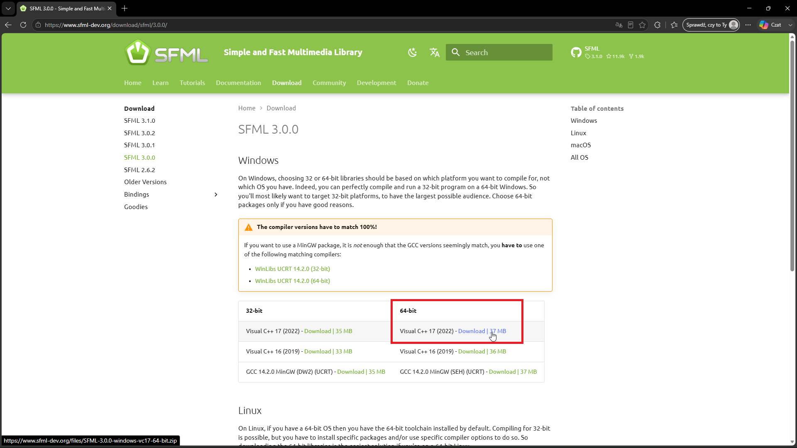

# Installation

The SFML 3.0 library can be downloaded from the official SFML website:
(https://www.sfml-dev.org)

At the time of writing this tutorial, the latest version of the library is SFML 3.1, so the download link for SFML 3.0 is not available directly from the main page.

SFML 3.0 can be downloaded from the release archive:
(https://www.sfml-dev.org/download/sfml/3.0.0/)



If you are using the 64-bit version of Visual Studio 2022, download the package labeled:

**Visual C++ 17 (2022) - 64-bit**

If you are using a different version of Visual Studio, choose the package that matches your compiler version.

After downloading the archive, extract it to a directory of your choice, for example:

`C:\SFML-3.0`

The extracted directory should contain the following structure:

```text
-bin
-doc
-examples
-include
-lib
-changelog.md
-license.md
-readme.md