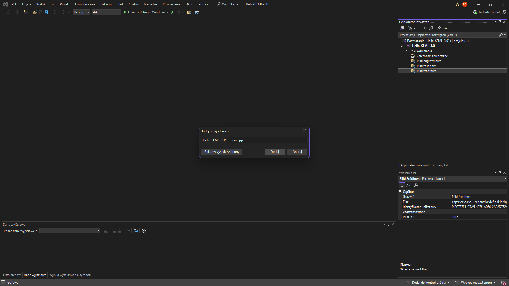
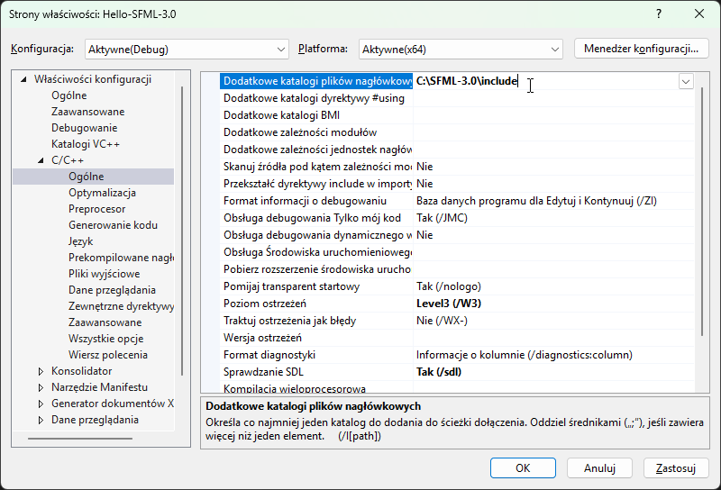
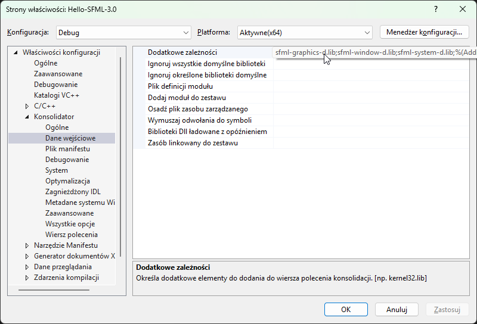
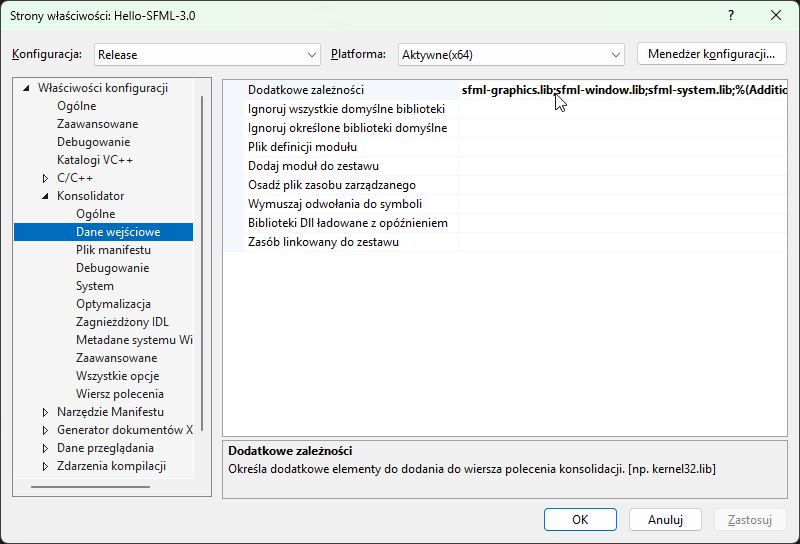

# Configuration

After downloading and extracting the SFML 3.0 library, you need to configure your project in Visual Studio 2022.

To do this, create a new **Empty Project** and add an empty `main.cpp` file.




Paste the following code into `main.cpp` and try to compile it. If it works, it means everything has been configured correctly.

```cpp
#include <iostream>

int main() {
    std::cout << "Hello World!" << std::endl;
    return 0;
}
```

Next, open the project properties by right-clicking the project name in **Solution Explorer** and selecting **Properties**.

## Project Configuration Consists of Four Steps

```text
- Set the C++ language standard
- Add the SFML header files directory
- Add the SFML libraries directory
- Add the libraries required during linking
```

## Setting the C++ Language Standard

SFML 3.0 requires a modern C++ standard.

Navigate to:

`C/C++ -> Language -> C++ Language Standard`

and select:

`ISO C++17 Standard (/std:c++17)`

or a newer standard, for example:

`ISO C++20 Standard (/std:c++20)`

## Adding the SFML Header Files Directory

First, you need to tell the compiler where to find the SFML header files.

Open the project properties and navigate to:

`C/C++ -> General -> Additional Include Directories`

Then enter the path to the `include` directory inside the extracted SFML package.

Example:

`C:\SFML-3.0\include`



After applying the changes, Visual Studio will be able to locate all SFML header files, such as:

```cpp
#include <SFML/Graphics.hpp>
#include <SFML/Window.hpp>
#include <SFML/System.hpp>
```

## Adding the SFML Libraries Directory

Next, you need to tell the linker where the SFML library files are located.

Navigate to:

`Linker -> General -> Additional Library Directories`

Then enter the path to the `lib` directory:

`C:\SFML-3.0\lib`


## Adding the Libraries Required During Linking

The final step is to add the SFML libraries that will be linked with your program.

Navigate to:

`Linker -> Input -> Additional Dependencies`

Add the following libraries:

```
sfml-graphics.lib
sfml-window.lib
sfml-system.lib
```

The libraries can be entered on separate lines or separated by semicolons.

For the **Debug** configuration, you can use the debug versions:

```
sfml-graphics-d.lib
sfml-window-d.lib
sfml-system-d.lib
```



For the **Release** configuration, use the libraries without the `-d` suffix.



## Copying the DLL Files

After configuring the project, you still need to copy the SFML DLL files to the directory from which the program is executed.

The DLL files are located in:

`C:\SFML-3.0\bin`

For the **Debug** configuration, copy:

```
sfml-graphics-d-3.dll
sfml-window-d-3.dll
sfml-system-d-3.dll
```

For the **Release** configuration, copy:

```
sfml-graphics-3.dll
sfml-window-3.dll
sfml-system-3.dll
```

Paste the DLL files into the directory containing your executable, for example:
`x64\Debug`
or
`x64\Release`

## First Program

Finally, we can run our first SFML program.

This program creates an 800×600 pixel window and draws a red rectangle with a size of 200×150 pixels. The rectangle is placed at position `(200, 200)`, measured from the upper-left corner of the window.

Notice that the `sf::RectangleShape` object is created only once before the main loop. Many beginner programmers create objects inside the `while` loop, causing them to be recreated unnecessarily every frame.

The program consists of two main parts:

* Window and object initialization
* The main program loop, which renders graphics

```cpp
#include <SFML/Graphics.hpp>

int main() {
    // create the window
    sf::RenderWindow window(
        sf::VideoMode(sf::Vector2u(800u, 600u)),
        "Hello SFML 3.0"
    );

    // create the rectangle
    sf::RectangleShape rect(sf::Vector2f(200.f, 150.f));
    rect.setFillColor(sf::Color::Red);
    rect.setPosition(sf::Vector2f(200.f, 200.f));

    while (window.isOpen()) {

        window.clear(sf::Color::Black);
        window.draw(rect);
        window.display();
    }
    
    return 0;
}
```


