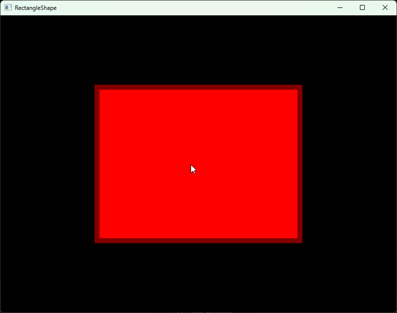
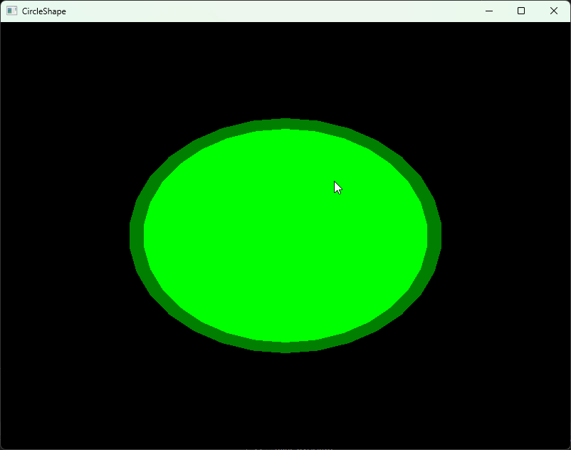
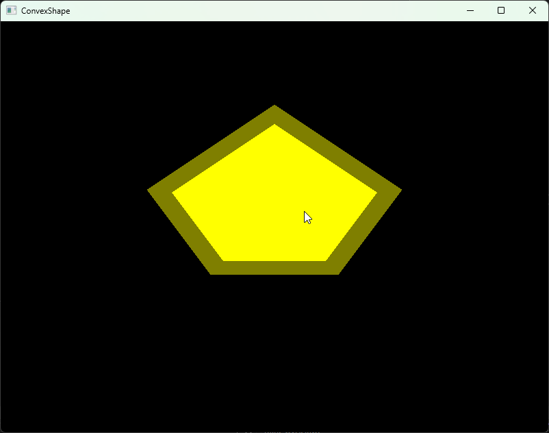

# Prymitywy

SFML oferuje kilka podstawowych kształtów, które można renderować na ekranie. Są to między innymi prostokąty, koła oraz kształty nieregularne.

W tej części poradnika poznamy sposób tworzenia i rysowania tych obiektów.

## Prostokąt (sf::RectangleShape)

Pierwszym kształtem jest prostokąt reprezentowany przez klasę sf::RectangleShape.

Poniższy program tworzy prostokąt o rozmiarze 400x300 pikseli w pozycji 200x150. Wypełnienie prostokąta ma kolor czerwony, natomiast obrys ma kolor ciemnoczerwony i grubość 10 pikseli.

Zwróć uwagę na zapis ``sf::Color(127, 0, 0)``

W tym przypadku kolor jest tworzony poprzez podanie kolejno składowych:
* Red (czerwony)
* Green (zielony)
* Blue (niebieski)

Każda wartość może przyjmować zakres od 0 do 255.

Możliwe jest również podanie czwartego parametru określającego przezroczystość (Alpha), jednak na razie nie będziemy z niego korzystać.


```cpp

#include <SFML/Graphics.hpp>

int main() {
    sf::RenderWindow window = sf::RenderWindow(sf::VideoMode(sf::Vector2u(800u, 600u)), "RectangleShape");
   
    sf::RectangleShape rect(sf::Vector2f(400.f, 300.f)); // stwórz prostokąt o rozmiarze 400x300
    rect.setFillColor(sf::Color::Red); // wypełnij prostokąt czerwonym kolorem
    rect.setOutlineThickness(10.0f); // ustaw obrys prostokąta tak, żeby miał 10 pikseli grubości
    rect.setOutlineColor(sf::Color(127, 0, 0)); // ustaw kolor obrysu na ciemnoczerwony
    rect.setPosition(sf::Vector2f(200.f, 150.f)); // umieść prostokąt w pozycji (200, 150)
   
    while(window.isOpen()) {
       
        window.clear(sf::Color::Black); // wyczyść ekran i wypełnij czarnym kolorem
        window.draw(rect); // narysuj prostokąt
        window.display(); // wyświetl
    }

    return 0;
}

```




## Okrąg (sf::CircleShape)

Klasa sf::CircleShape służy do rysowania okręgów i kół. Jako parametr konstruktora przyjmuje promień okręgu. W naszym przykładzie promień wynosi 100 pikseli.

Okrąg jest wypełniony kolorem zielonym oraz posiada ciemnozielony obrys o grubości 10 pikseli.
Dodatkowo użyliśmy funkcji setScale, która skaluje obiekt dwukrotnie w poziomie oraz 1,5 raza w pionie. Funkcja ta działa dla wszystkich klas dziedziczących po sf::Transformable, między innymi dla prostokątów, okręgów i sprite'ów.
W przykładzie została również użyta funkcja setOrigin. Domyślnie punkt odniesienia każdego kształtu znajduje się w jego lewym górnym rogu. Dla okręgu o promieniu 100 pikseli środek znajduje się w punkcie (100, 100), dlatego ustawiamy punkt odniesienia właśnie na tę pozycję.
Dzięki temu wszystkie transformacje, takie jak pozycjonowanie, obrót czy skalowanie, będą wykonywane względem środka okręgu.
Na końcu ustawiamy pozycję kształtu na (400, 300), czyli dokładnie w środku okna o rozmiarze 800x600 pikseli.

Warto zwrócić uwagę, że po zastosowaniu skali (2.0, 1.5) kształt przestaje być idealnym okręgiem i staje się elipsą.

```cpp
#include <SFML/Graphics.hpp>

int main() {
    sf::RenderWindow window = sf::RenderWindow(sf::VideoMode(sf::Vector2u(800u,600u)), "CircleShape");
   
    sf::CircleShape circle(100.f); // stwórz okrąg o promieniu równym 100 pikseli
    circle.setFillColor(sf::Color::Green); // wypełnij okrąg zielonym kolorem
    circle.setOutlineThickness(10.0f); // ustaw szerokość obrysu okręgu na 10 pikseli
    circle.setOutlineColor(sf::Color(0, 127, 0)); // wypełnij obrys ciemnozielonym kolorem
    circle.setOrigin(sf::Vector2f(100.f, 100.f)); // ustaw środek okręgu na (100, 100)
    circle.setScale(sf::Vector2f(2.f, 1.5f)); // ustaw skalę okręgu 2x poziomie i 1.5x w pionie
    circle.setPosition(sf::Vector2f(400.f,300.f)); // umieść okrąg w pozycji (400, 300) 
   
    while(window.isOpen()) {
       
        window.clear(sf::Color::Black); // wyczyść ekran i wypełnij czarnym kolorem
        window.draw(circle); // narysuj okrąg
        window.display(); // wyświetl
    }

    return 0;
}
```



## Wielokąt (sf::ConvexShape)
Ostatnim kształtem dostępnym w bibliotece SFML 3.0 jest wielokąt wypukły (sf::ConvexShape). W przeciwieństwie do prostokąta czy okręgu, jego kształt definiujemy samodzielnie poprzez podanie kolejnych punktów.

W poniższym przykładzie tworzymy pięciokąt składający się z pięciu wierzchołków. Najpierw określamy liczbę punktów za pomocą funkcji setPointCount, a następnie ustawiamy położenie każdego z nich przy użyciu funkcji setPoint.

Po zdefiniowaniu kształtu ustawiamy jego punkt odniesienia (setOrigin) na środek wielokąta znajdujący się w pozycji (150, 150). Dzięki temu wszystkie transformacje, takie jak przesuwanie, obracanie czy skalowanie, będą wykonywane względem środka figury.

Następnie nadajemy wielokątowi żółty kolor wypełnienia oraz ciemnożółty obrys o grubości 10 pikseli. Dla demonstracji działania transformacji wykorzystujemy również funkcję setScale, która rozciąga kształt trzykrotnie w poziomie i dwukrotnie w pionie. Na końcu ustawiamy pozycję wielokąta na (400, 250) i wyświetlamy go w oknie.

```cpp
#include <SFML/Graphics.hpp>

int main() {
	sf::RenderWindow window = sf::RenderWindow(sf::VideoMode(sf::Vector2u(800u, 600u)), "ConvexShape");	

	sf::ConvexShape convex;
	convex.setPointCount(5); // ustaw liczbę punktów kształtu (piąciokąt)
	convex.setPoint(0, sf::Vector2f(150.f, 100.f)); // ustaw kolejno punkty wielokąta
	convex.setPoint(1, sf::Vector2f(200.f, 150.f));
	convex.setPoint(2, sf::Vector2f(175.f, 200.f));
	convex.setPoint(3, sf::Vector2f(125.f, 200.f));
	convex.setPoint(4, sf::Vector2f(100.f, 150.f));

	convex.setOrigin(sf::Vector2f(150.f, 150.f));	//ustaw środek wielokąta na (150, 150)
	convex.setFillColor(sf::Color::Yellow);	// wypełnij wielokąt żółtym kolorem
	convex.setOutlineThickness(10.0f);	// ustaw szerokość obrysu wielokąta na 10 pikseli
	convex.setOutlineColor(sf::Color(127, 127, 0));	// wypełnij obrys wielokąta ciemnożółtym kolorem
	convex.setScale(sf::Vector2f(3.f, 2.f));	// ustaw skalę wielokąta - 3x w poziomie i 2x w pionie
	convex.setPosition(sf::Vector2f(400.f, 250.f)); // umieść wielokąt w pozycji (400, 250)

	
	while (window.isOpen()) {
		
		window.clear(sf::Color::Black); // wyczyść ekran i wypełnij czarnym kolorem
		window.draw(convex);	// narysuje wielokąt
		window.display();	// wyświetl
	}

    return 0;
}
```

Po uruchomieniu programu na ekranie zostanie wyświetlony żółty pięciokąt z ciemnym obrysem. Dzięki zastosowaniu funkcji setScale jego proporcje zostaną dodatkowo zmodyfikowane, co pokazuje, że wielokąty obsługują te same transformacje co pozostałe kształty dostępne w bibliotece SFML.

Uwaga: Punkty wielokąta powinny być podawane zgodnie z kolejnością obiegu kształtu (zgodnie lub przeciwnie do ruchu wskazówek zegara). Podanie punktów w przypadkowej kolejności może spowodować nieprawidłowe wyświetlenie figury.




