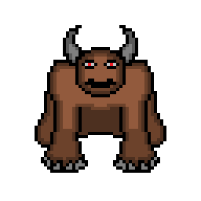
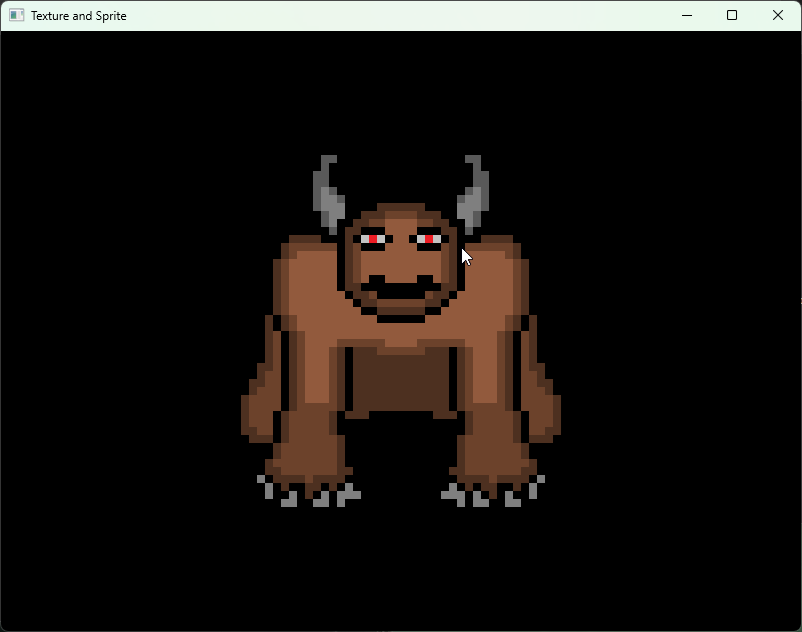

# Textures and Sprites

To draw an image in SFML, two things are required: a texture and a sprite.

A texture (sf::Texture) is an object that stores image data in the graphics card's memory. It can be loaded from a file, such as a PNG or JPG image. However, a texture by itself is not visible on the screen.

A sprite (sf::Sprite) is an object used to display a texture in a window. A sprite has properties such as position, rotation, scale, and other rendering-related attributes. Multiple sprites can share the same texture object, allowing the same image to be displayed in different locations without loading the file multiple times (this is the idea behind texture managers).

First, a texture must be loaded. Then, the texture is assigned to a sprite. Finally, the sprite is drawn in the window using the draw() function. The following code demonstrates exactly this process.

Texture used in the example program: <br />



```cpp
#include <SFML/Graphics.hpp>
#include <iostream>

int main() {
    sf::RenderWindow window = sf::RenderWindow(sf::VideoMode(sf::Vector2u(800u, 600u)), "Texture and Sprite");
	
    sf::Texture texture; // create Texture object

    // Load texture from file "bies.png"
    if (!texture.loadFromFile("bies.png")) {
        std::cout << "Failed to load texture" << std::endl;        
        return 0;
    }

    sf::Sprite sprite(texture); // create a sprite and assign the texture to it
    sprite.setOrigin(sf::Vector2f(texture.getSize() / 2u)); // set the origin to the center of the texture
    sprite.setPosition(sf::Vector2f(window.getSize() / 2u)); // place the sprite in the center of the window
    sprite.setScale(sf::Vector2f(2.f, 2.f)); // scale the sprite 2x horizontally and vertically
    
    while (window.isOpen()) {

        while (const std::optional event = window.pollEvent()) {

            if (event->is<sf::Event::Closed>())
                window.close();
        }

        window.clear(sf::Color::Black);
        window.draw(sprite); // draw the sprite
        window.display(); 
    }

    return 0;
}
```


