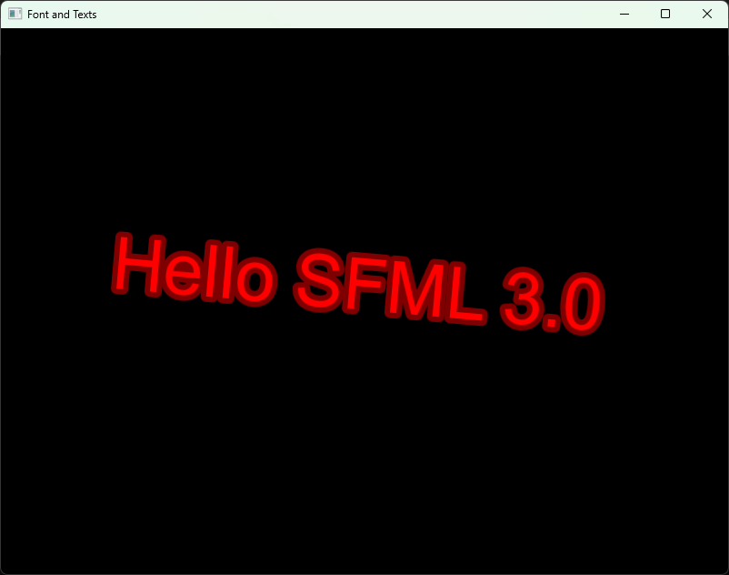

# Czcionki i Teksty

Żeby narysować napis w SFML 3.0, potrzebujemy czcionki oraz obiektu typu ``sf::Text``. 

Czcionka (ang. font) definiuje wygląd znaków, takich jak litery, cyfry i symbole. To właśnie dzięki niej tekst może zostać wyświetlony na ekranie w określonym kroju pisma.

W SFML czcionki reprezentowane są przez klasę ``sf::Font``. Przed użyciem czcionki należy ją załadować z pliku za pomocą funkcji ``openFromFile()``. Po poprawnym wczytaniu czcionki możemy utworzyć obiekt ``sf::Text``, przekazując do niego czcionkę, treść napisu oraz rozmiar znaków.

Obiekt ``sf::Text`` oferuje wiele możliwości modyfikacji wyglądu tekstu. Możemy zmieniać jego kolor, pozycję, obrót, skalę, grubość obramowania czy kolor obramowania. Dzięki temu łatwo dostosujemy wygląd napisów do potrzeb naszej aplikacji lub gry.

Poniższy przykład prezentuje wczytanie czcionki z pliku systemowego Windows, utworzenie napisu oraz wyśrodkowanie go w oknie aplikacji. Następnie tekst zostaje narysowany na czarnym tle.

Funkcja ``getLocalBounds()`` klasy ``sf::Text`` zwraca obiekt typu ``sf::FloatRect``, który zawiera informacje o lokalnych wymiarach tekstu. Za pomocą pól position i size możemy odczytać położenie oraz szerokość i wysokość obszaru zajmowanego przez napis. W prezentowanym przykładzie wykorzystujemy szerokość tekstu do obliczenia jego pozycji, dzięki czemu może zostać wyśrodkowany w oknie aplikacji.

Funkcja ``getLineSpacing(characterSize)`` klasy ``sf::Font`` zwraca wysokość pojedynczej linii tekstu w pikselach dla podanego rozmiaru znaków. Wartość ta uwzględnia odstęp pomiędzy kolejnymi liniami tekstu i jest przydatna podczas rozmieszczania wielu napisów jeden pod drugim. W naszym przykładzie została użyta do obliczenia pionowej pozycji tekstu podczas jego centrowania względem okna.

```cpp
#include <SFML/Graphics.hpp>
#include <iostream>

int main() {
    sf::RenderWindow window = sf::RenderWindow(sf::VideoMode(sf::Vector2u(800u, 600u)), "Font and Texts");

    // stwórz obiekt czionki
    sf::Font font;

    // załaduj czcionkę z Windowsa
    if (!font.openFromFile("C:\\Windows\\Fonts\\arial.ttf")) {
        std::cout << "Failed to load font!" << std::endl;
        return 0;
    }

    unsigned int characterSize = 79u; // ustaw wielkość znaków na 79

    // stwórz obiekt type Text z czionką z określoną wielkością
    sf::Text text(font, "Hello SFML 3.0", characterSize);
    text.setFillColor(sf::Color::Red); // wypełnij tekst czerwonym kolorem
    text.setOutlineThickness(6.f); // dodaj obrys o grubości 6 pikseli
    text.setOutlineColor(sf::Color(127, 0, 0)); // wypełnij obrys ciemno czerwonym kolorem
    text.setRotation(sf::degrees(5.f)); // obróć tekst względem lewego górnego rogu o 5 stopnii

    // oblicz pozycje tekstu w taki sposób, by znalazł się na środku okna
    sf::Vector2u textPosition;
    textPosition.x = (window.getSize().x - (unsigned int)(text.getLocalBounds().size.x)) / 2u;
    textPosition.y = (window.getSize().y - (unsigned int)(font.getLineSpacing(characterSize))) / 2u;
    textPosition.y -= 47u; // podnieś tekst trochę wyżej

    text.setPosition(sf::Vector2f(textPosition)); // pozycjonowanie tekstu

    while (window.isOpen()) {
        while (const std::optional event = window.pollEvent()) {
            if (event->is<sf::Event::Closed>())
                window.close();
        }

        window.clear(sf::Color::Black); // wyczyść ekran i wypełnij czarnym kolorem
        window.draw(text);              // narysuj tekst
        window.display();               // wyświetl zawartość okna
    }

    return 0;
}
```

