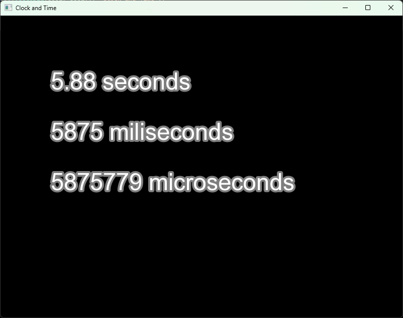

# Clock and Time

Measuring time is often necessary in programs, especially in video games. Time measurement is essential for tasks such as creating animations, handling delays, tracking gameplay time, displaying timers, or performing specific actions at regular intervals.

SFML provides the ``sf::Clock`` and ``sf::Time`` classes for this purpose. The ``sf::Clock`` class works like a stopwatch—it allows you to measure the amount of time that has passed since the clock was created or last restarted. The ``sf::Time`` class, on the other hand, stores a measured time value and allows it to be conveniently retrieved in seconds, milliseconds, or microseconds. Together, these classes make it easy to manage and control the passage of time in your applications.

```cpp
#include <SFML/Graphics.hpp>
#include <iostream>

int main() {
    sf::RenderWindow window = sf::RenderWindow(sf::VideoMode(sf::Vector2u(800u, 600u)), "Clock and Time");
    
    // create a Font object
    sf::Font font;
   
    // load the Font frowm Windows
    if(!font.openFromFile("C:\\Windows\\Fonts\\arial.ttf")) {
        std::cerr << "Failed to load font!" << std::endl;
        return 0;
    }

    // create a Text for Seconds
    sf::Text textSeconds(font, "0 seconds", 47u);
    textSeconds.setFillColor(sf::Color::White);
    textSeconds.setOutlineThickness(4.f);
    textSeconds.setOutlineColor(sf::Color(127, 127, 127));
    textSeconds.setPosition(sf::Vector2f(100.f, 100.f));

    // create a Text for MiliSeconds
    sf::Text textMiliSeconds(font, "0 miliseconds", 47u);
    textMiliSeconds.setFillColor(sf::Color::White);
    textMiliSeconds.setOutlineThickness(4.f);
    textMiliSeconds.setOutlineColor(sf::Color(127, 127, 127));
    textMiliSeconds.setPosition(sf::Vector2f(100.f, 200.f));

    // create a Text for MicroSeconds
    sf::Text textMicroSeconds(font, "0 microseconds", 47u);
    textMicroSeconds.setFillColor(sf::Color::White);
    textMicroSeconds.setOutlineThickness(4.f);
    textMicroSeconds.setOutlineColor(sf::Color(127, 127, 127));
    textMicroSeconds.setPosition(sf::Vector2f(100.f, 300.f));

    sf::Clock clock; // create a clock to measure time

    while (window.isOpen()) {

        while (const std::optional event = window.pollEvent()) {

            if (event->is<sf::Event::Closed>())
                window.close();
        }

        sf::Time time = clock.getElapsedTime(); // get the elapsed time

        std::stringstream seconds;
        seconds << std::fixed << std::setprecision(2) << time.asSeconds(); // format the time to 2 decimal places

        textSeconds.setString(seconds.str() + " seconds");
        textMiliSeconds.setString(std::to_string(time.asMilliseconds()) + " miliseconds");
        textMicroSeconds.setString(std::to_string(time.asMicroseconds()) + " microseconds");

        window.clear(sf::Color::Black); // clear screen and fill it with black color
        window.draw(textSeconds);	// draw seconds text
        window.draw(textMiliSeconds);	// draw miliseconds text
        window.draw(textMicroSeconds);	// draw microseconds text
        window.display(); // display the contents of the window
    }

    return 0;
}
```

