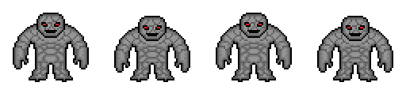
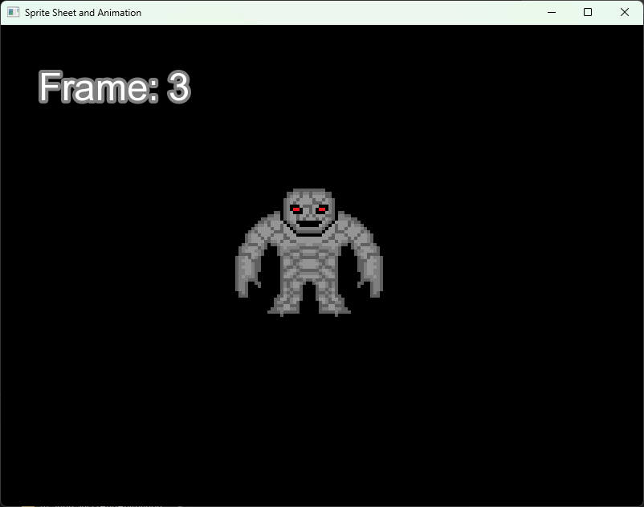

# Sprite Sheet and Animation

In the previous chapters, we learned about textures, sprites, text, and time measurement. Now we will combine these concepts to create a simple character animation using a single image file, commonly known as a sprite sheet.

A sprite sheet is an image that contains multiple animation frames arranged next to each other. Instead of loading each frame as a separate file, we can load a single image and display only the selected portion of it. In SFML, this is done using the ``setTextureRect()`` function, which allows us to specify the rectangular area of the texture that should be displayed on the sprite.

The ``setTextureRect()`` function takes an object of type ``sf::IntRect`` as its argument. This object stores the position and size of the texture region to be displayed. By changing this rectangle, we can display different animation frames by moving it across the sprite sheet.

In this example, we will also use the previously introduced ``sf::Clock`` and ``sf::Time`` classes to change the animation frame at regular time intervals. Additionally, we will display the index of the current animation frame using a text object.

The program first loads the ``sprite_sheet.png`` texture, which contains all animation frames. Next, it creates a sprite and sets the initial texture region using the ``setTextureRect()`` function.

The ``frameSize`` variable specifies the size of a single animation frame. In our example, each frame has a size of ``128×128`` pixels. The ``framesCount`` variable stores the total number of frames contained in the sprite sheet.

The index of the current frame is stored in the ``currentFrame`` variable. To move to the next frame, we simply increment its value by one. The modulo operator (``%``) ensures that after the last frame is reached, the animation returns to the first frame.

After calculating the current frame index, we create an ``sf::IntRect`` object that defines the texture region to display. The ``x`` position of the rectangle depends on the current frame index and the width of a single frame.

If ``currentFrame`` is equal to ``0``, the displayed texture region starts at ``x = 0``. If ``currentFrame`` is equal to ``1``, the displayed region starts at ``x = 128``. For each subsequent frame, the ``x`` position is shifted by the width of one frame.

To control the animation speed, we use a clock. The program checks whether more than ``0.2`` seconds have elapsed since the last frame change. If so, the animation advances to the next frame.

Finally, we also update the text displayed in the window so that it shows the index of the current animation frame.

In this way, we can create a simple animation using a single image file. This is a very common technique in 2D games because it allows multiple animation frames to be stored in a single texture while making it easy to choose which frame should be displayed at any given moment.

Sprite sheet used in this example: <br />


```cpp
#include <SFML/Graphics.hpp>
#include <iostream>

int main() {
    sf::RenderWindow window = sf::RenderWindow(sf::VideoMode(sf::Vector2u(800u, 600u)), "Sprite Sheet and Animation");
    
    // create a Font object
    sf::Font font;
   
    // load the font from the Windows Fonts directory
    if(!font.openFromFile("C:\\Windows\\Fonts\\arial.ttf")) {
        std::cout << "Failed to load font!" << std::endl;
        return 0;
    }

    sf::Texture spriteSheetTexture; // create a texture to hold the sprite sheet
    if(!spriteSheetTexture.loadFromFile("sprite_sheet.png")) { // load the sprite sheet from a file
        std::cout << "Failed to load texture!" << std::endl;
        return 0;
    }

    // create a text object to display the current frame
    sf::Text frameText(font, "Frame: 0", 47u);
    frameText.setFillColor(sf::Color::White);
    frameText.setOutlineThickness(4.f);
    frameText.setOutlineColor(sf::Color(127, 127, 127));
    frameText.setPosition(sf::Vector2f(47.f, 47.f));

    // animation variables
    sf::Vector2i frameSize(128, 128);
    int framesCount = 4;

    // variables used to control the animation
    sf::Clock clock;
    sf::Time prevTime = clock.getElapsedTime();
    int currentFrame = 0;

    sf::Sprite sprite(spriteSheetTexture);
    sprite.setTextureRect(sf::IntRect(sf::Vector2i(0, 0), frameSize)); // set the first frame
    sprite.setScale(sf::Vector2f(2.f, 2.f));
    sprite.setPosition(sf::Vector2f(256.f, 160.f));

    while (window.isOpen()) {

        while (const std::optional event = window.pollEvent()) {

            if (event->is<sf::Event::Closed>())
                window.close();
        }

        sf::Time currentTime = clock.getElapsedTime(); // get the elapsed time

        if ((currentTime - prevTime).asSeconds() > 0.2f) {

            currentFrame = (currentFrame + 1) % framesCount;

            sf::IntRect textureRect;
            textureRect.position = sf::Vector2i(currentFrame * frameSize.x, 0);
            textureRect.size = frameSize;
            sprite.setTextureRect(textureRect); // set the texture rect to display the current frame

            frameText.setString("Frame: " + std::to_string(currentFrame)); // update the text to display the current frame

            prevTime = currentTime;
        }

        window.clear(sf::Color::Black);
        window.draw(sprite);
        window.draw(frameText);
        window.display();
    }

    return 0;
}
```

