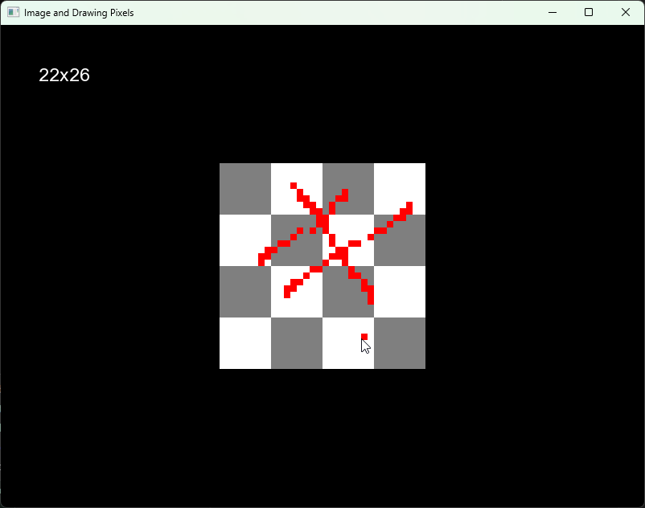

# Image and Drawing Pixels

```cpp
#include <SFML/Graphics.hpp>
#include <iostream>

int main() {
    sf::RenderWindow window = sf::RenderWindow(sf::VideoMode(sf::Vector2u(800u, 600u)), "Image and Drawing Pixels");

    // create a Font object
    sf::Font font;

    // load the font from the Windows Fonts directory
    if (!font.openFromFile("C:\\Windows\\Fonts\\arial.ttf")) {
        std::cout << "Failed to load font!" << std::endl;
        return 0;
    }

    // create a text object to display the cursor position
    sf::Text coordsText(font, "0x0", 23u);
    coordsText.setFillColor(sf::Color::White);
    coordsText.setPosition(sf::Vector2f(47.f, 47.f));

    sf::Image canvas;
    if (!canvas.loadFromFile("canvas.png")) {
        std::cout << "Failed to load canvas.png!" << std::endl;
        return 0;
    }

    sf::Texture texture;
    if(!texture.loadFromImage(canvas)) {
        std::cout << "Failed to load texture from canvas!" << std::endl;
        return 0;
    }

    sf::Vector2f canvasSize(32.f, 32.f);
    float canvasScale = 8.f;
    sf::Vector2f canvasPosition(
        ((float)window.getSize().x - (canvasSize.x * canvasScale))/2.f,
        ((float)window.getSize().y - (canvasSize.y * canvasScale))/2.f
    );

    sf::Sprite sprite(texture);
	sprite.setScale(sf::Vector2f(canvasScale, canvasScale));
	sprite.setPosition(canvasPosition);

	sf::RectangleShape cursor(sf::Vector2f(canvasScale, canvasScale));
        cursor.setFillColor(sf::Color::Red);

    while (window.isOpen()) { 

        while (const std::optional event = window.pollEvent()) {

            if (event->is<sf::Event::Closed>())
                window.close();
            
            if(const auto* mm = event->getIf<sf::Event::MouseMoved>(); mm) {
                sf::Vector2f cursorPosition;
                cursorPosition.x = mm->position.x / (int)canvasScale * (int)canvasScale;
                cursorPosition.y = mm->position.y / (int)canvasScale * (int)canvasScale;
				
                cursorPosition.x = std::clamp(cursorPosition.x, canvasPosition.x, canvasPosition.x + (canvasSize.x * canvasScale) - canvasScale);
                cursorPosition.y = std::clamp(cursorPosition.y, canvasPosition.y, canvasPosition.y + (canvasSize.y * canvasScale) - canvasScale);

                cursor.setPosition(cursorPosition);

                coordsText.setString(
                    std::to_string((int)((cursorPosition.x - canvasPosition.x) / canvasScale)) + "x" +
                    std::to_string((int)((cursorPosition.y - canvasPosition.y) / canvasScale))
                );
            }

            if (const auto* kp = event->getIf<sf::Event::KeyPressed>(); kp && kp->code == sf::Keyboard::Key::S) {
                if (!canvas.saveToFile("image.png")) {
                    std::cout << "Failed to save image.png!" << std::endl;
                }
            }
        }

        if (sf::Mouse::isButtonPressed(sf::Mouse::Button::Left)) {

            sf::Vector2u pixelToEdit;
            pixelToEdit.x = (int)((cursor.getPosition().x - canvasPosition.x) / canvasScale);
            pixelToEdit.y = (int)((cursor.getPosition().y - canvasPosition.y) / canvasScale);
            canvas.setPixel(pixelToEdit, sf::Color::Red);
            texture.update(canvas);
        }

        window.clear(sf::Color::Black);
        window.draw(sprite);
        window.draw(cursor);
        window.draw(coordsText);
        window.display();
    }

    return 0;
}
```
