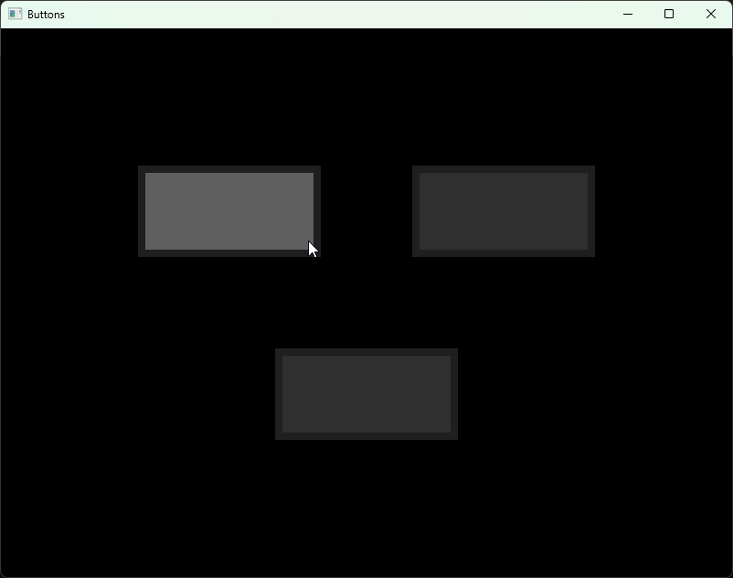

# Button



```cpp
#include <SFML/Graphics.hpp>
#include <iostream>
#include <functional>
#include <memory>

sf::Vector2f mousePosition;

enum class ButtonState { Idle, Hovered, Pressed };

class Button;

std::shared_ptr<Button> hoveredButton = nullptr;
std::shared_ptr<Button> pressedButton = nullptr;

class Button : public std::enable_shared_from_this<Button>{
public:
    sf::FloatRect _rect;
    sf::Color _idleColor;
    sf::Color _hoverColor;
    sf::Color _pressedColor;
    std::function<void()> _onClickFunction;

    ButtonState _state;

    Button(sf::Vector2f size, sf::Vector2f position, sf::Color idleColor, sf::Color hoverColor, sf::Color pressedColor);
    ~Button();

    void cursorHover();
    void handleEvent(const sf::Event& event);
    void update();
    void draw(sf::RenderWindow& window);
};

Button::Button(sf::Vector2f size, sf::Vector2f position, sf::Color idleColor, sf::Color hoverColor, sf::Color pressedColor) {
    _rect = sf::FloatRect(position, size);

    _idleColor = idleColor;
    _hoverColor = hoverColor;
    _pressedColor = pressedColor;

    state = ButtonState::Idle;
}

Button::~Button() {

}

void Button::cursorHover() {
    if (_rect.contains(mousePosition)) {
        hoveredButton = this->shared_from_this();
    }
}

void Button::handleEvent(const sf::Event& event) {
    if (const auto* mbp = event.getIf<sf::Event::MouseButtonPressed>(); mbp && mbp->button == sf::Mouse::Button::Left) {
        if (hoveredButton.get() == this) {
            pressedButton = this->shared_from_this();
            _state = ButtonState::Pressed;
        }
    }
}

void Button::update() {
    if (_state == ButtonState::Pressed) {
        if (_onClickFunction) {
            _onClickFunction();
        }

        if(pressedButton.get() == this) {
            pressedButton = nullptr;
        }

        _state = ButtonState::Idle;
    }
    else if (hoveredButton.get() == this) {
        _state = ButtonState::Hovered;
    }
    else {
        _state = ButtonState::Idle;
    }
}

void Button::draw(sf::RenderWindow& window) {

    float borderSize = 8.f;
    sf::Color borderColor = sf::Color(31, 31, 31);

    sf::RectangleShape rectangleShape;
    rectangleShape.setSize(_rect.size - sf::Vector2f(2.f * borderSize, 2.f * borderSize));
    rectangleShape.setPosition(_rect.position + sf::Vector2f(borderSize, borderSize));
    rectangleShape.setOutlineThickness(borderSize);
    rectangleShape.setOutlineColor(borderColor);
     
    switch (_state) {
        case ButtonState::Hovered:
            rectangleShape.setFillColor(_hoverColor);
            break;
        case ButtonState::Pressed:
            rectangleShape.setFillColor(_pressedColor);
            break;
        default:
            rectangleShape.setFillColor(_idleColor);
            break;
    }

    window.draw(rectangleShape);
}

int main() {
    sf::RenderWindow window = sf::RenderWindow(sf::VideoMode(sf::Vector2u(800u, 600u)), "Buttons");
	
    std::shared_ptr<Button> button1 = std::make_shared<Button>(
        sf::Vector2f(200.f, 100.f), 
        sf::Vector2f(150.f, 150.f), 
        sf::Color(47, 47, 47),
        sf::Color(95, 95, 95),
        sf::Color(63, 63, 63)
    );

    button1->_onClickFunction = []() {
        std::cout << "Button 1 clicked!" << std::endl;
    };
    
    std::shared_ptr<Button> button2 = std::make_shared<Button>(
        sf::Vector2f(200.f, 100.f), 
        sf::Vector2f(450.f, 150.f), 
        sf::Color(47, 47, 47),
        sf::Color(95, 95, 95),
        sf::Color(63, 63, 63)
    );

    button2->_onClickFunction = []() {
        std::cout << "Button 2 clicked!" << std::endl;
    };
     
    std::shared_ptr<Button> button3 = std::make_shared<Button>(
        sf::Vector2f(200.f, 100.f),
        sf::Vector2f(300.f, 350.f),
        sf::Color(47, 47, 47),
        sf::Color(95, 95, 95),
        sf::Color(63, 63, 63)
    );

    button3->_onClickFunction = []() {
        std::cout << "Button 3 clicked!" << std::endl;
    };

    while (window.isOpen()) {

        mousePosition = window.mapPixelToCoords(sf::Mouse::getPosition(window));

        hoveredButton = nullptr;
        button1->cursorHover();
        button2->cursorHover();
        button3->cursorHover();

        while (const std::optional event = window.pollEvent()) {

            if (event->is<sf::Event::Closed>())
                window.close();

            button1->handleEvent(*event);
            button2->handleEvent(*event);
            button3->handleEvent(*event);
        }
        
        button1->update();
        button2->update();
        button3->update();

        window.clear(sf::Color::Black);
        button1->draw(window);
        button2->draw(window);
        button3->draw(window);
        window.display();
    }
}
```